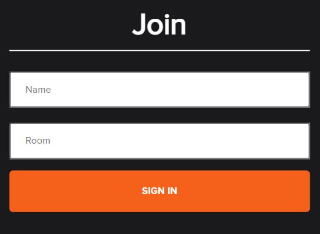
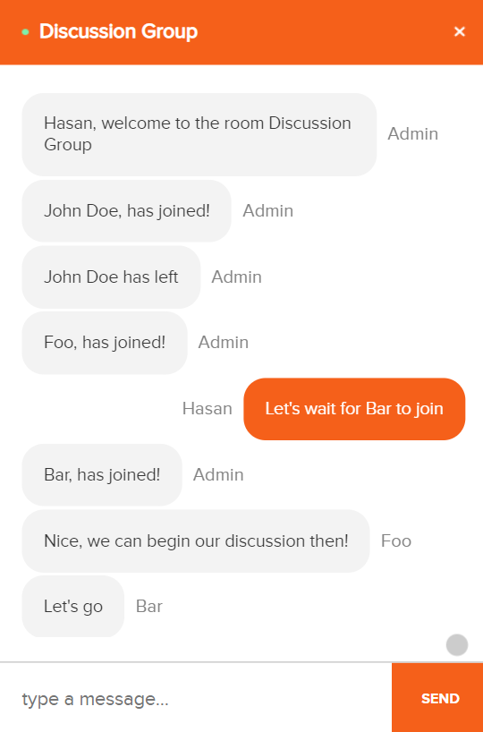
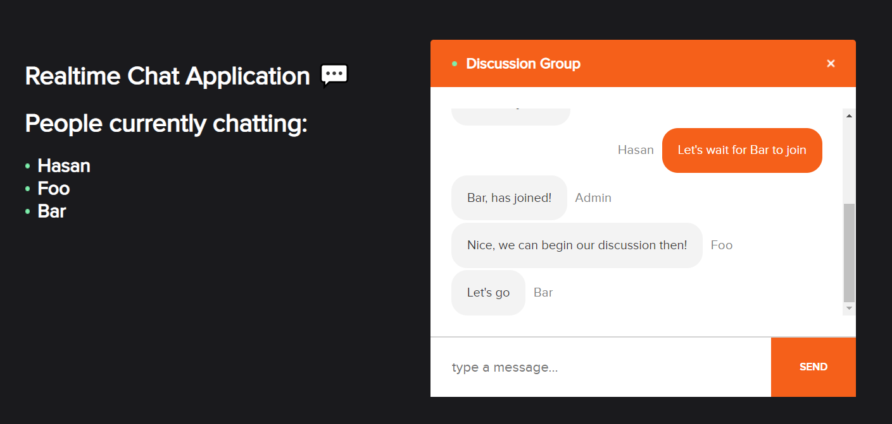
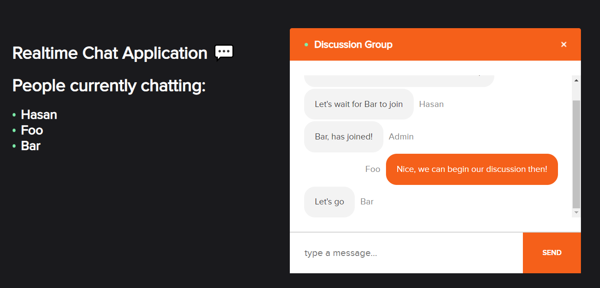
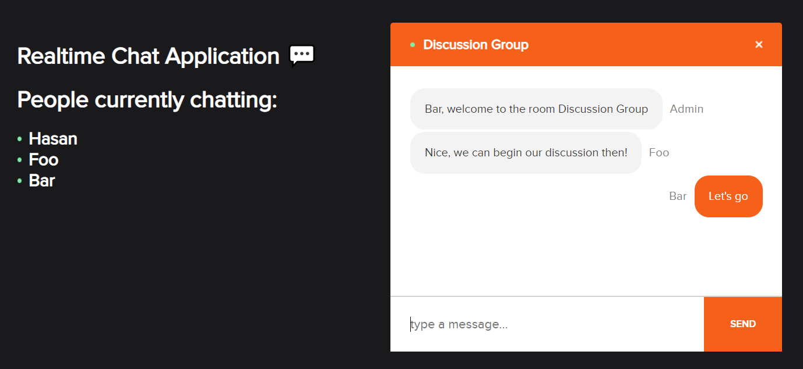

# Chat Application


> A simple realtime chat application 💬

## Technologies Used

- [ExpressJs](https://expressjs.com/)
- [React](https://reactjs.org/)
- [NodeJs](https://nodejs.org/en/)
- [TypeScript](https://www.typescriptlang.org/)
- [Socket.io](https://socket.io/)
- [Vite](https://vitejs.dev/)

## Features

- Join room chat
- Room chat can have multiple users at the same time
- Messaging between users in the same room
- Enable to show users who are in the room

From a technical standpoint, this project is useful for:

- Demonstrating simple usage of `socket.io` for realtime chat
- Demonstrating boostrap `React` with `Vite`
- Reference on connecting Frontend and Backend for a chat application
- Uses `TypeScript` on both the frontend and backend
- Other code implementations that might be useful to learn

## Screenshots







## Setup

To run this project, here are the requirements:

- NPM (9.1.3)
- Node (18.12.1)

To look around with the code you can `git clone` this repository, or see it in GitHub Dev Mode (Click `"."`in your browser, or change `github.com` to `github.dev`).

## Usage

### Backend

1. Go to the [`server`](./server) directory.
2. Create `.env` file with an example of the following content:
```
PORT=4012
ORIGIN=http://localhost:5173/
```
3. Install all the packages with `npm install`.
4. Run it with `npm run dev`.

### Frontend

1. Go to the [`client`](./client) directory.
2. Create `.env` file with an example of the following content:
```
VITE_SERVER_ENDPOINT=http://localhost:4012/
```
3. Install all the packages with `npm install`.
4. Run it with `npm run dev`.

## Room for Improvement

Room for improvement:

- Deployment for Frontend and Backend
- Have persistent storage using Databases
- Handle errors more gracefully
- Add more features such as Sign Up / Log In / Other cool features

## Troubleshoot Lesson

<details>
  <summary>Stuff that I faced and solved when doing this project</summary>

- If you can’t declare the same variable in one project in express, use `export {}` as stated in [here](https://stackoverflow.com/a/62912102/15574446).
  - Or use`allowSyntheticDefaultImports` and `esModuleInterop` in `tsconfig.json` to be able to use `import` in project.
- Having Environment Variable Error → **Ensure** that `.env` is on the same folder with `package.json` file 🤦‍♂️.
- Having CORS error → Use `transports: ['websocket']` in Client and setup CORS in server, see more info [here](https://stackoverflow.com/a/66076532/15574446).
- `<React.StrictMode/>` made `useEffect()` render twice for some reason, see more info [here](https://stackoverflow.com/questions/61254372/my-react-component-is-rendering-twice-because-of-strict-mode).
- See how to use absolute import on `React` and `Vite` [here](https://dev.to/abdeldjalilhachimi/how-to-avoid-long-path-import-using-react-with-ts-and-vite-4e2h).

</details>

## Acknowledgements

- [JavaScript Mastery](https://github.com/adrianhajdin) tutorial on Realtime Chat Application ⭐
- StackOverFlow
- Google
- ChatGPT
- All other resources in the internet that have been used


## Contact

Developed by [mhasan01](https://mhasan01.com/) - feel free to contact me!
